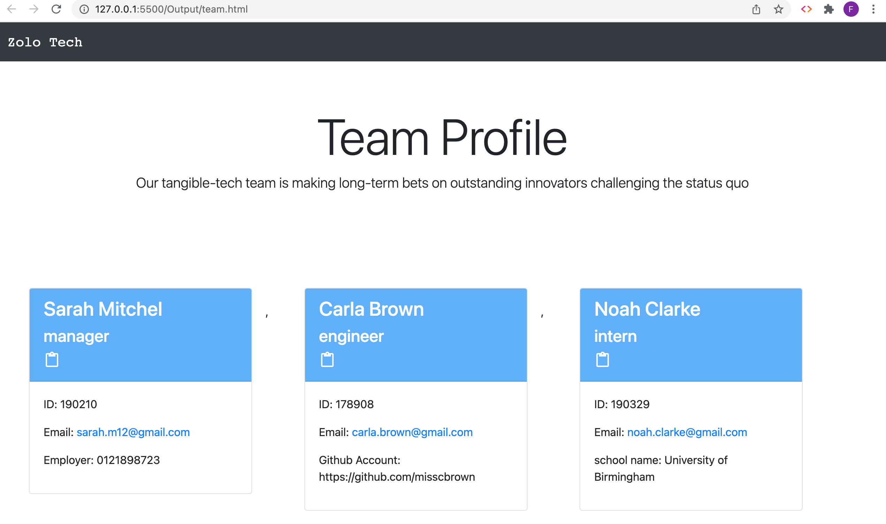
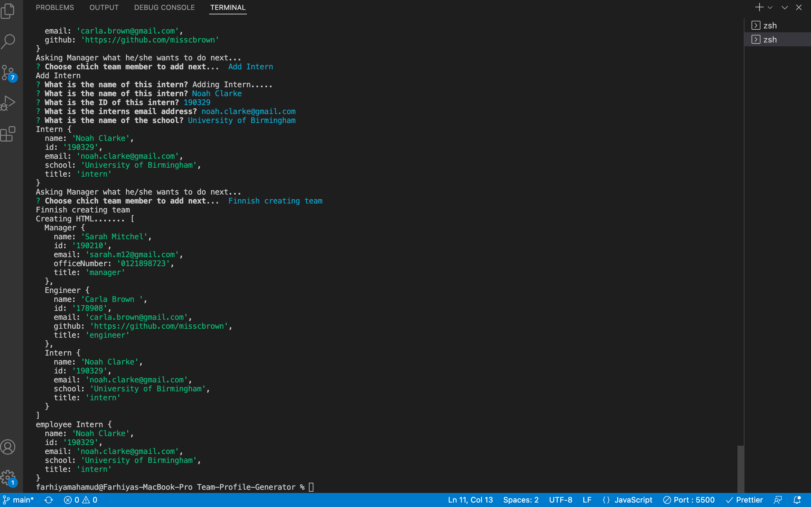

# Team-Profile-Generator

Building a Node.js command-line application that takes in information about employees on a software engineering team, then generates a HTML webpage that displays summaries for each person.

# Why did I build this project?

To create a command-line application that dynamically generates a html file from a user's input using the Inquirer package in the terminal using node.js. To also build on my javascript skills in a different enviroment.

# So far I have achieved?

1. To generate a html file to display different team members information of a software enigereeing company through a series of prompts that is to be answered in the terminal.

2. Once a team member has been created, the user is given a great overview of each team member, which is displayed in the console. This allows the user to check for any input data problems that they may have missed. This is an optional finishing touch that I felt would be useful.

# What I intend to add in the near future?

1. To continue to build on it with the skills I continue to gain. Altering structure for different idustries. Have better styling. Get the link for the github to work. Generate html using companies branding colours and logo. Perhaps work with a database to get the companies employees information and dynamically display that.

## User Story

```md
AS A manager
I WANT to generate a webpage that displays my team's basic info
SO THAT I have quick access to their emails and GitHub profiles
```

## Acceptance Criteria Set To Achieve This

```md
GIVEN a command-line application that accepts user input
WHEN I am prompted for my team members and their information
THEN an HTML file is generated that displays a nicely formatted team roster based on user input
WHEN I click on an email address in the HTML
THEN my default email program opens and populates the TO field of the email with the address
WHEN I click on the GitHub username
THEN that GitHub profile opens in a new tab
WHEN I start the application
THEN I am prompted to enter the team manager’s name, employee ID, email address, and office number
WHEN I enter the team manager’s name, employee ID, email address, and office number
THEN I am presented with a menu with the option to add an engineer or an intern or to finish building my team
WHEN I select the engineer option
THEN I am prompted to enter the engineer’s name, ID, email, and GitHub username, and I am taken back to the menu
WHEN I select the intern option
THEN I am prompted to enter the intern’s name, ID, email, and school, and I am taken back to the menu
WHEN I decide to finish building my team
THEN I exit the application, and the HTML is generated
```

# To access this project the following links are provided:

To access Github Repository

1. https://github.com/Farhiya1/Team-Profile-Generator.git

To access Application deployed at live URL

2. https://farhiya1.github.io/Team-Profile-Generator/

To access Application Demo via Link.

3.

# Screenshot of deployed application)

1. Screenshot displaying Generated Team Profile page



2. Screenshot of terminal with Prompts



# References

1. https://www.npmjs.com/package/inquirer
2. https://www.w3schools.com/nodejs/nodejs_filesystem.asp
   https://www.freecodecamp.org/news/how-to-write-a-good-readme-file/
